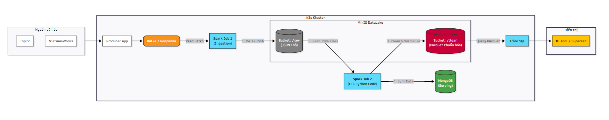

# Big Data for IT Jobs
### 1. Thông tin nhóm
* Nguyễn Khổng Duy Hoàng
* Hoàng Đức Khải
* Trịnh Hoàng Chi
* Trần Thế Khiêm
* Phạm Minh Toàn
### 2. Sơ đồ Kiến trúc Hệ thống

### 3. Đáp ứng tiêu chí
* Data Ingestion → crawler/API + Kafka.
* Data Processing → Spark batch + streaming.
* Stream Processing → flash sale, real-time order.
Data Storage → NoSQL + HDFS.
* System Integration → API dashboard.
* Performance Optimization → partition theo category/product_id.
* Monitoring → log số đơn, latency Kafka.
* Scaling → thêm nhiều nguồn (TopCV, Vietnamworks, ITviec).
* Data Quality & Testing → kiểm tra giá, bỏ spam reviews.
* Security & Governance → phân quyền (admin, seller).
* Fault Tolerance → backup data orders.
